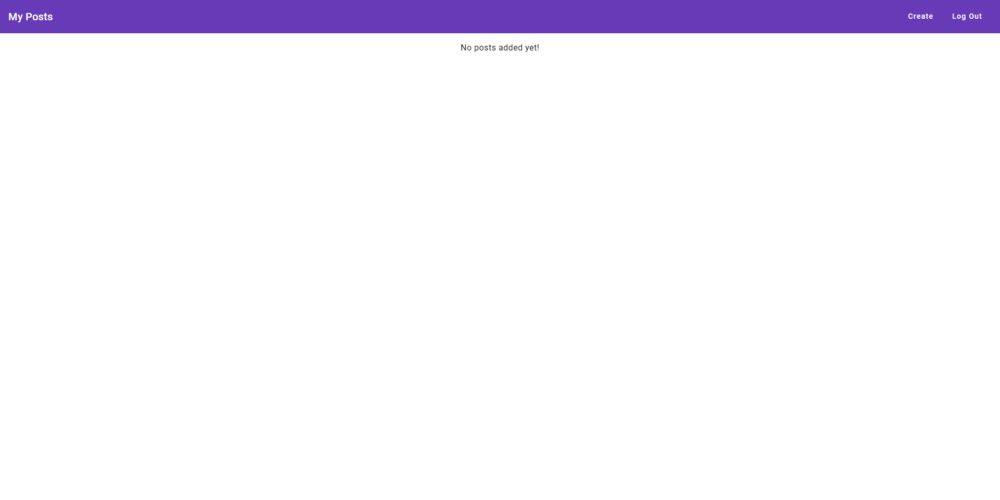
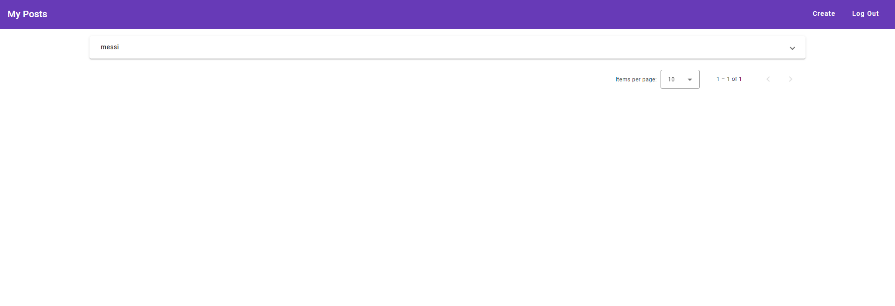
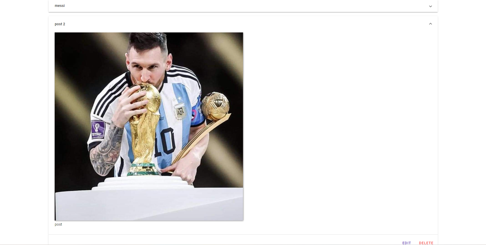
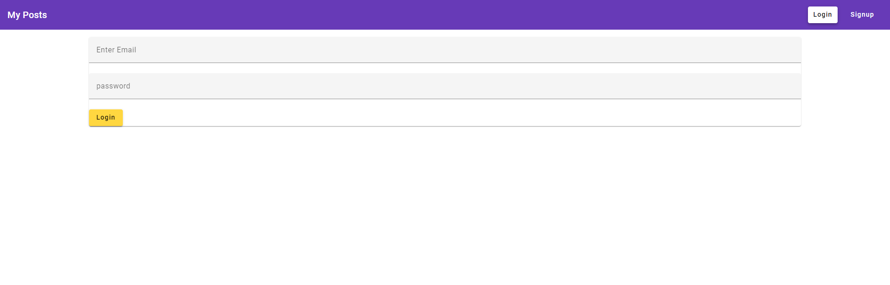
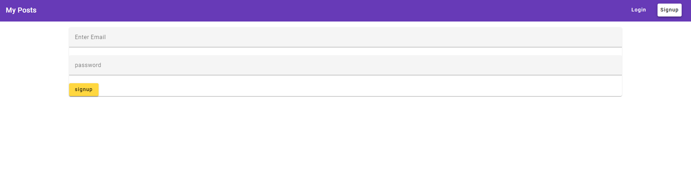
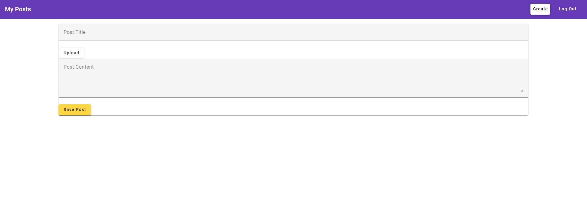
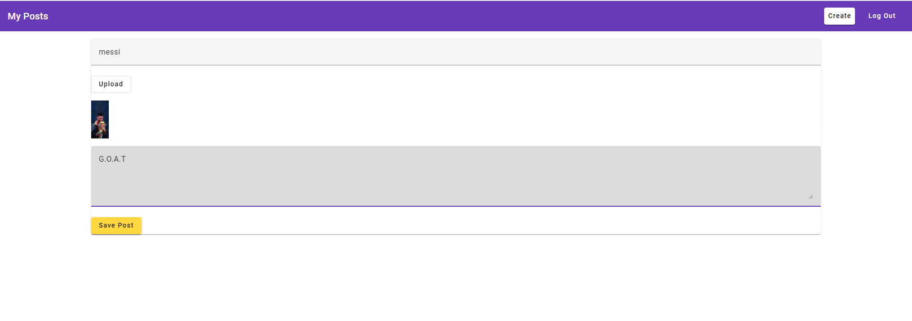

# PostsSpa

This project was generated with Angular  version 15.0.5.

## Development server

## Clone this repo to your devcie then run " npm install " to install dependencies

## Clone "https://github.com/AymnKhalifa/posts-backend" repo and install dependencies then run 'nodemon server' to start backend

## Run `ng serve` for a dev server. Navigate to `http://localhost:4200/`. The application will automatically reload if you change any of the source files.

